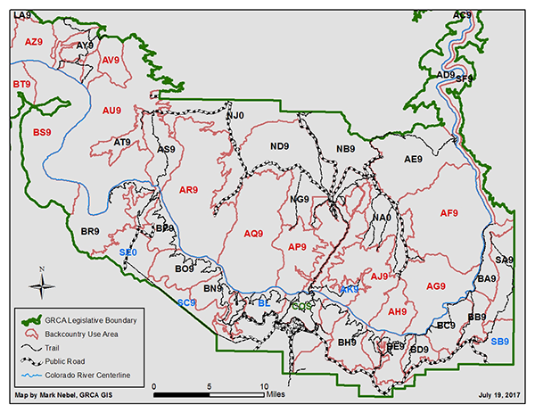

[R for Data Science](https://r4ds.had.co.nz/) by Hadley Wickham and Garrett Grolemund is a go-to resource for the data-curious who want to learn R and the tidyverse by curling up with a good book. After spending the summer interning on Garrett's RStudio Academy team, I wanted to brush up on my basics (and pick up skills I have otherwise been missing), so what better way than to methodically work my way through the text? And what better way to hold myself accountable than to blog about it, and put my progress out into the [#rstats](https://twitter.com/hashtag/rstats) community to get feedback and encouragement.

Resources for those studying from R4DS are numerous already. There are [crowdsourced solutions manuals](https://jrnold.github.io/r4ds-exercise-solutions/), and even a vibrant R4DS community on [Twitter](https://twitter.com/R4DScommunity) and [Slack](https://www.rfordatasci.com/). With that in mind, what can I possibly offer that _isn't_ just another reproduction of the book's analyses of the `nycflights`, `gapminder`, and other standard data sets?

One of the strengths that I recognized immediately in the book's preface is its emphasis on _workflow_:

```{r echo = FALSE, fig.alt = "The R4DS Workflow: Import; Tidy; Transform; Explore: Transform, Visualize, Model, Repeat; Communicate", out.width="500px"}
knitr::include_graphics("images/r4ds-workflow.png")
```

We *import* data into a data frame in R; *tidy* it into a stored form consistent with its meaning; *transform* it by narrowing our focus to interesting observations (and creating new variables and summaries);  explore it with *vizualization* and *models*, and (the part that this blog is, in part, going to play) *communicate* the results of our analysis.

_Bingo_. That's my focus - as I progress through the book chapter-by-chapter, I'll share how I apply this workflow to one of my personal [projects](/projects), an analysis of backcountry area use at Grand Canyon National Park that I'm calling [GrandR](https://github.com/dfailing/GrandR) (pronounced _grander_). As the project progresses, I'll update this blog with a play-by-play of the interesting R tricks I use along the way. I'll also update the corresponding GitHub repository with the data, R scripts, and (ultimately) a report of my findings. Until I can get a comment system up and running here (with [utteranc.es](https://utteranc.es/)), feel free to share your thoughts and feedback with me on [GitHub](https://github.com/dfailing), [Twitter](https://twitter.com/david_failing) or via email at [david.failing@gmail.com](mailto:david.failing@gmail.com).

```{r echo = FALSE, fig.alt = "Map of Backcountry Use Areas and Classifications at Grand Canyon National Park", out.width="500px"}

```